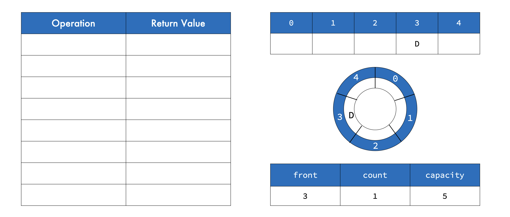
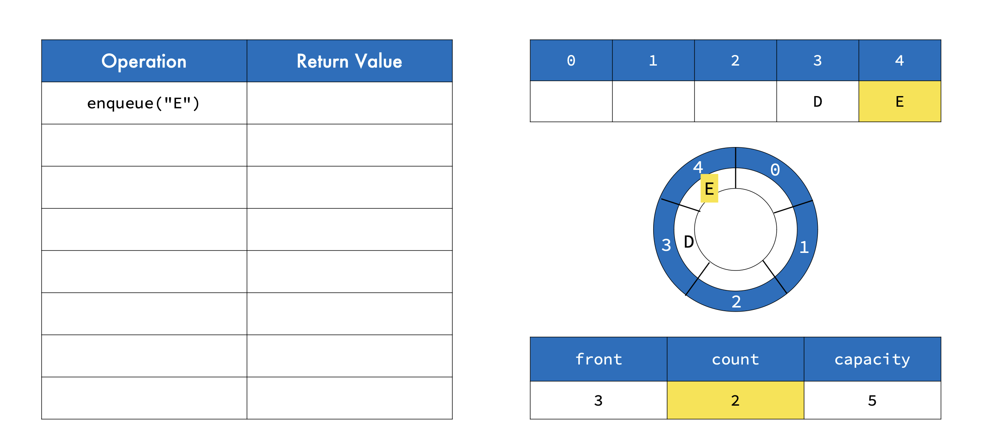
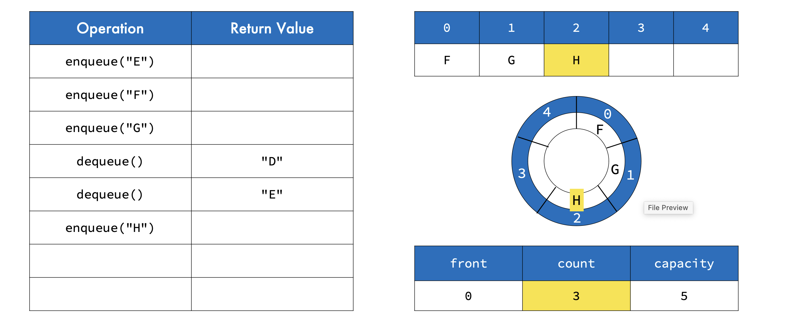

What are Circular Queues?

• Queues implemented with a circular array
• Elements are stored in a circular manner
• Elements that are appended and exceed capacity are placed in the beginning
• Also called a ring buffer

• A fixed size array that wraps around at the end
• If index is greater than or equal to the array capacity, it
wraps around back to zero
• The previous index before the beginning is the capacity of
the array

Append Algorithm
1. If count >= capacity then set index to 0 (or count mod
capacity)
2. Set array[index] to value
3. Increment count
• Need to consider front variable for circular queue

