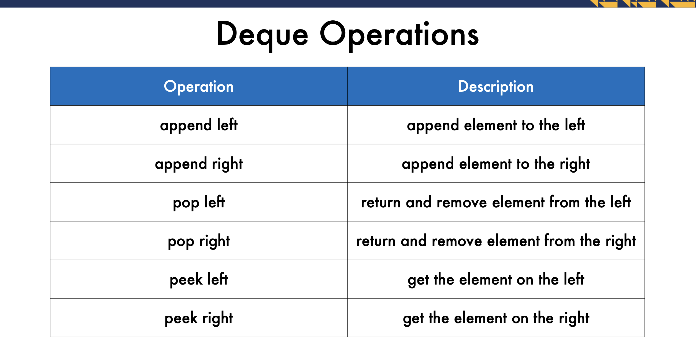
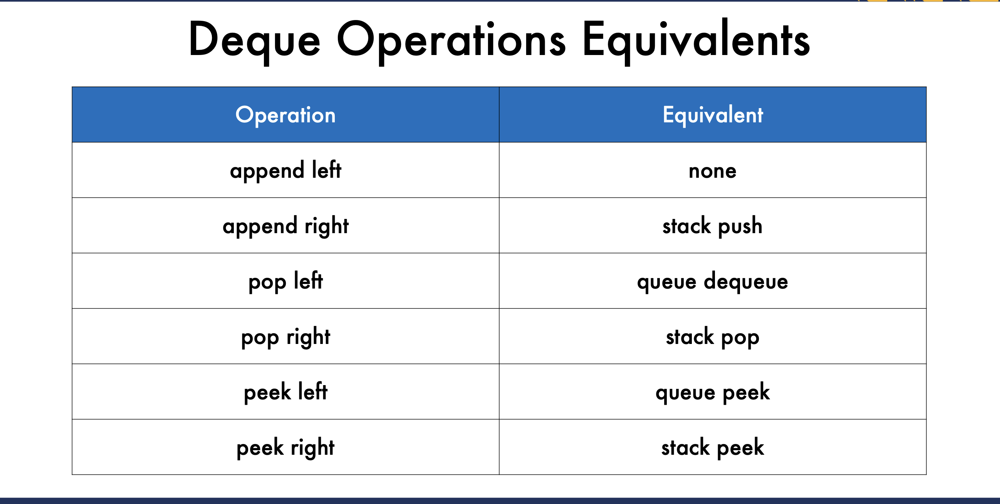
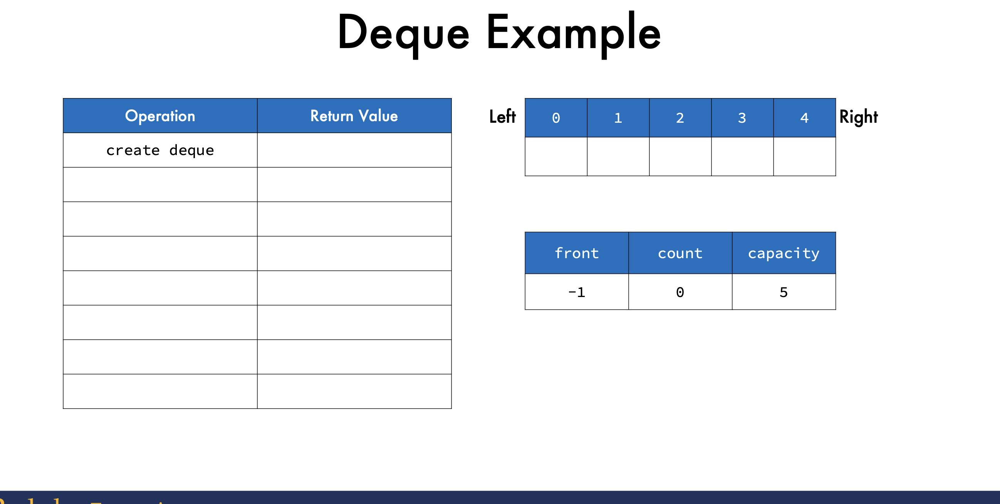
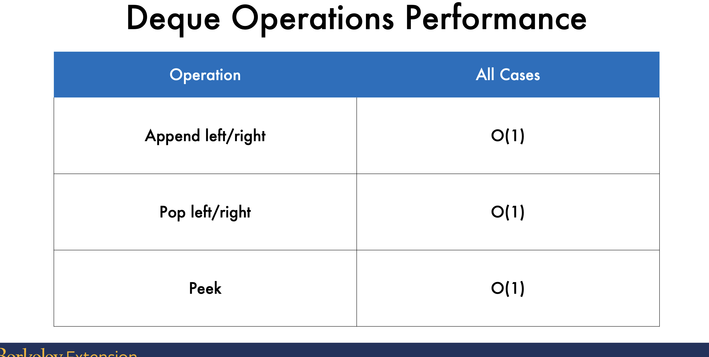
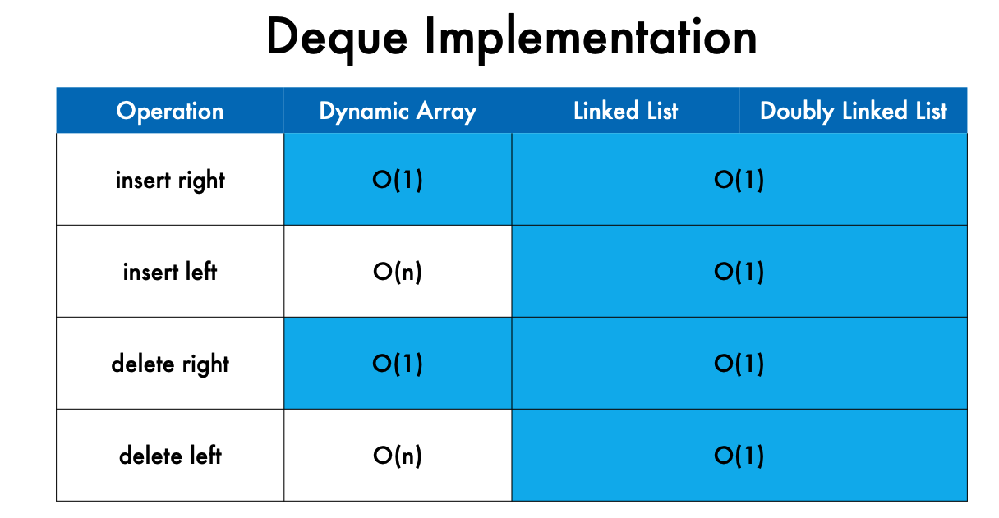

***Deques***

What are Deques?    
• Double-ended queues   
• Combination of stacks and queues  
• Allow elements to be added or deleted from either the front or the back   
• Previously called dequeues

***Deque Applications***
undo tracking   
task scheduling     
browser history     
security cameras

