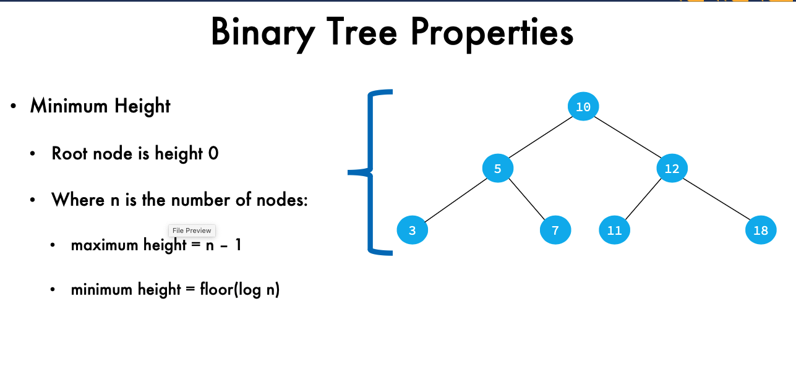
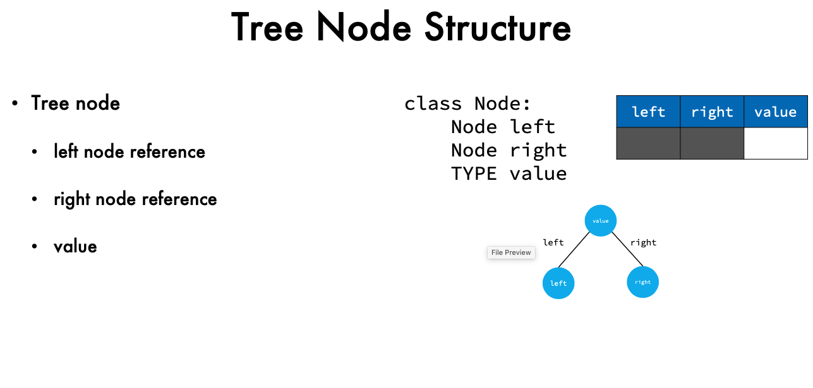
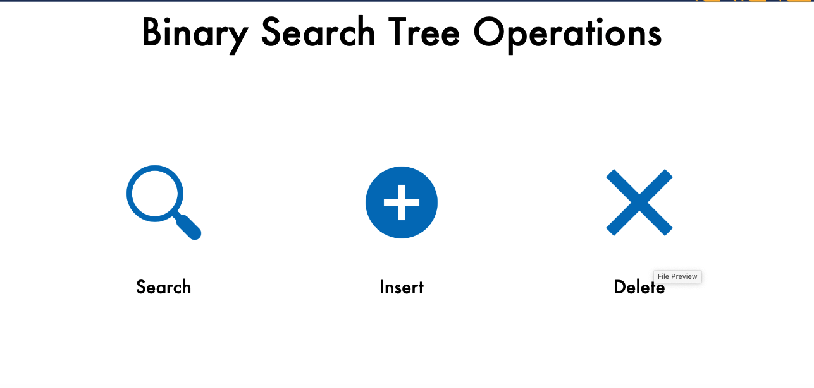
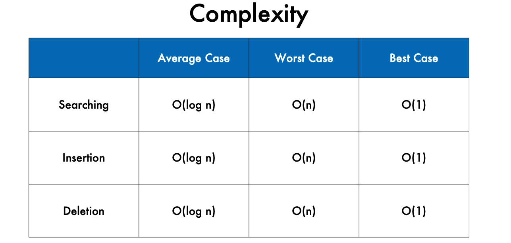

What are Binary Trees?  
• Trees with nodes that have 0, 1 or 2 child nodes  
• Have child nodes are named left and right 
__• Have height determined by the number of nodes see image below __

What are Binary Search Trees?   
• Binary trees that have a binary search condition  
__• Have no duplicate values__  
__• Left descendants contain values lower than ancestor nodes__ 

