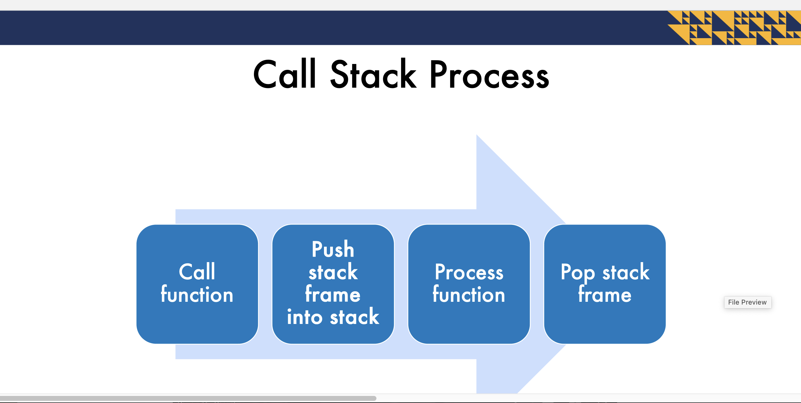

**What is a Call Stack?**
• Memory location where data in function calls (stack frames) are placed
• Uses a stack as a data structure
• Only the last stack frame is active at a time

Stack Frame
• Contents:
• function parameters
• local variables
• return address
• The top of the call stack is the active frame

Each function call adds to the call stack  
• Data is added to the call stack even if function does not
explicitly create new data  
• Stack overflow occurs when call stack does not have
enough space or reaches the call stack limit  
• Usually caused by a function not reaching the base case

