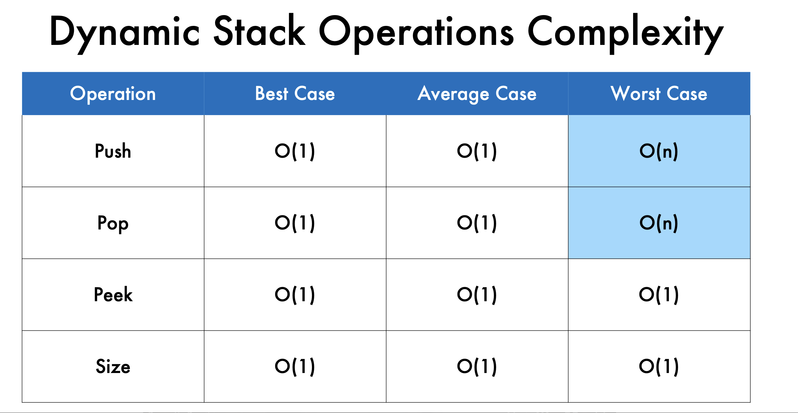

__Dynamic Stacks__

__Static Stack Limitations__
• Same as using static arrays
• Capacity is fixed
• Allocating too much memory is wasteful
• Allocating too little memory makes data structure too limited

**static stack capacity don't change we have to define at first unlike teh dynamic which gets updated easily**

What are Dynamic Stacks?
• Stacks without a fixed capacity
• Usually implemented using a dynamic structure, such as a
dynamic array
• Capacity is checked after any operation that modifies the
count of elements
• Capacity is adjusted only if required

