What is a Graph?    
• A data structure that specializes in relationships    
• Consists of nodes (vertices) and edges    
• Models several real world systems such as networks    

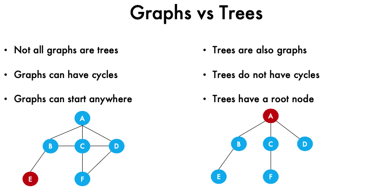
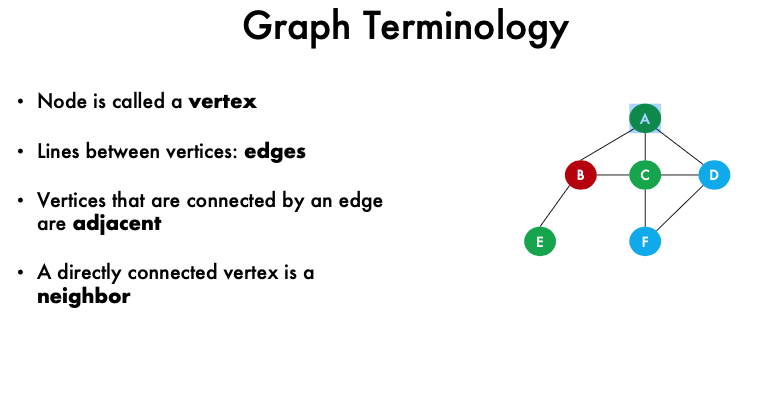
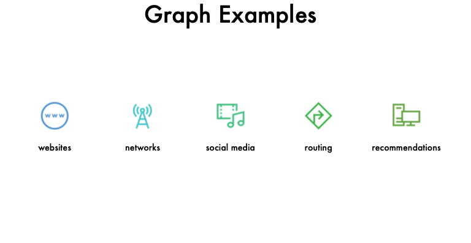
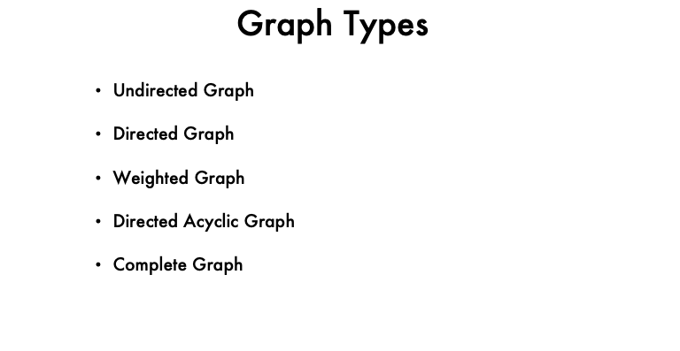   
<!-- 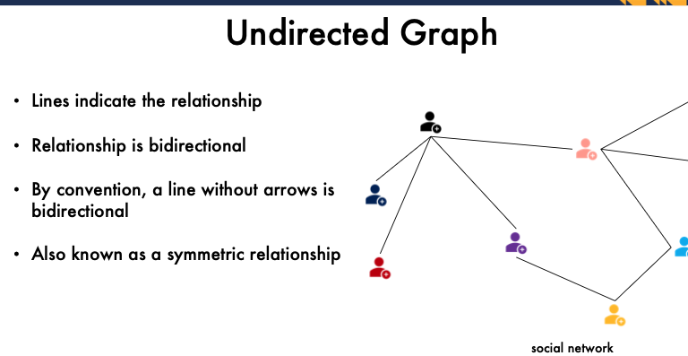](image-55.png) -->
]
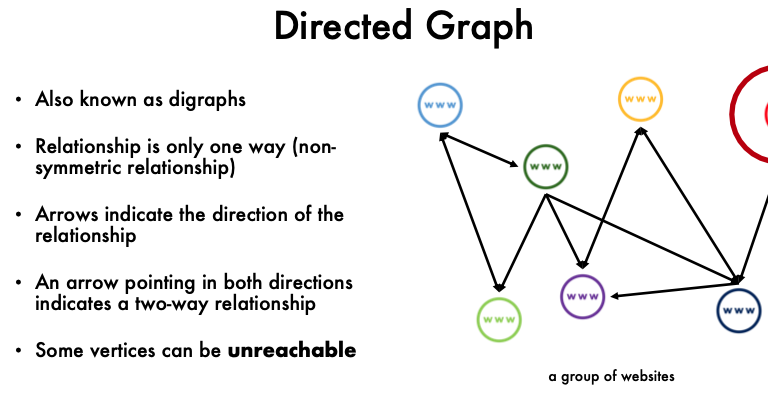
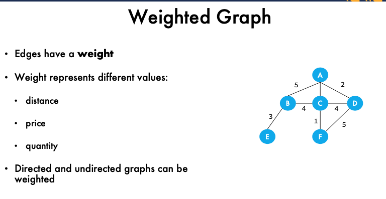
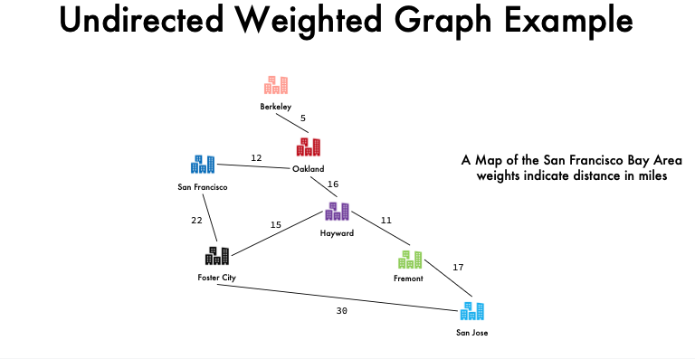
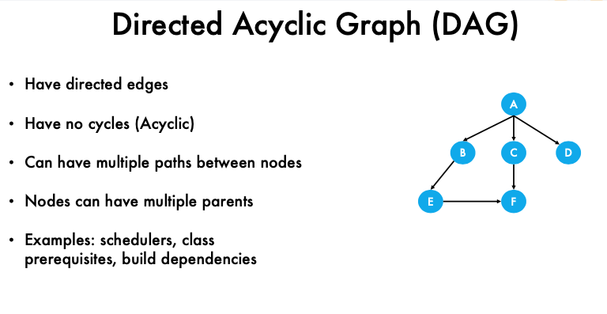
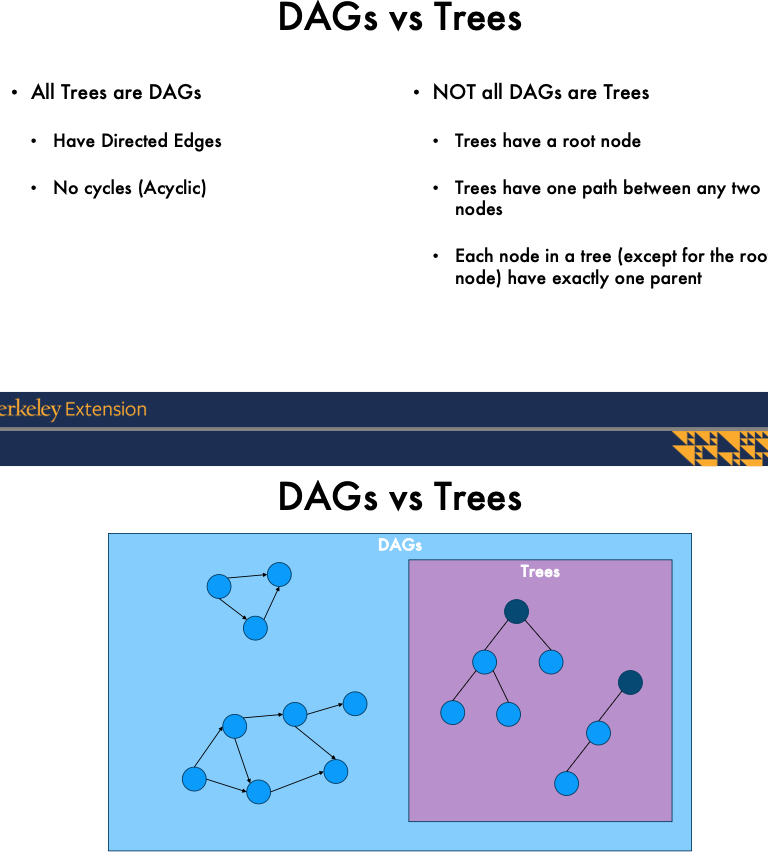
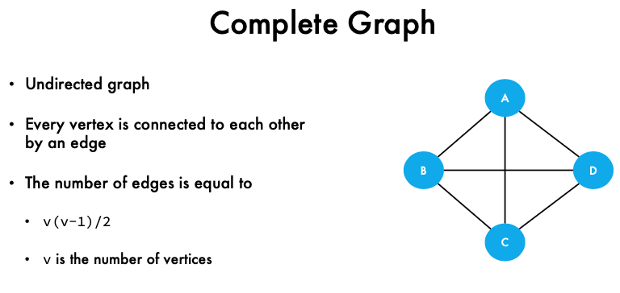

