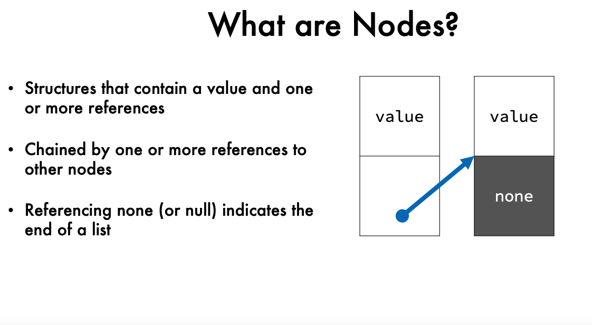
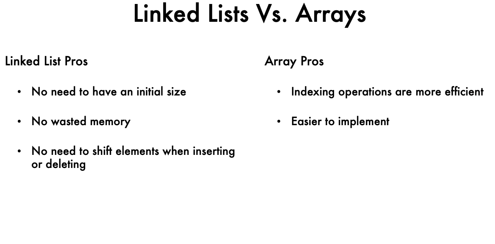
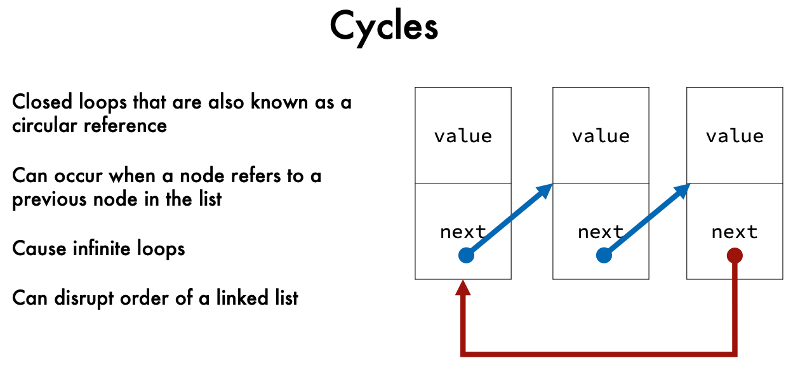
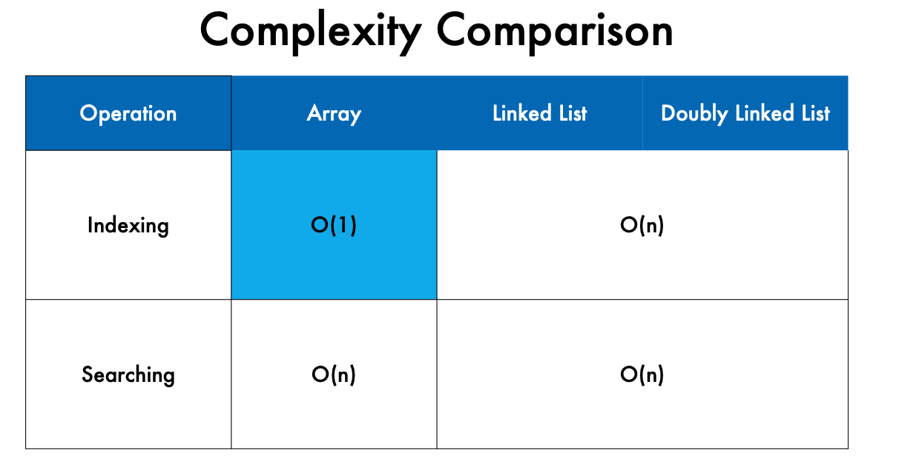
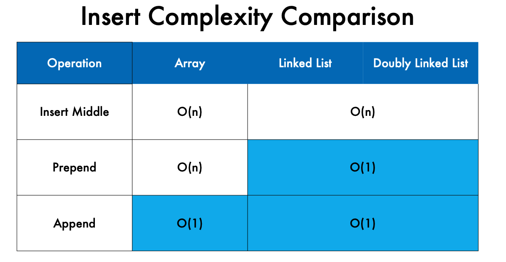
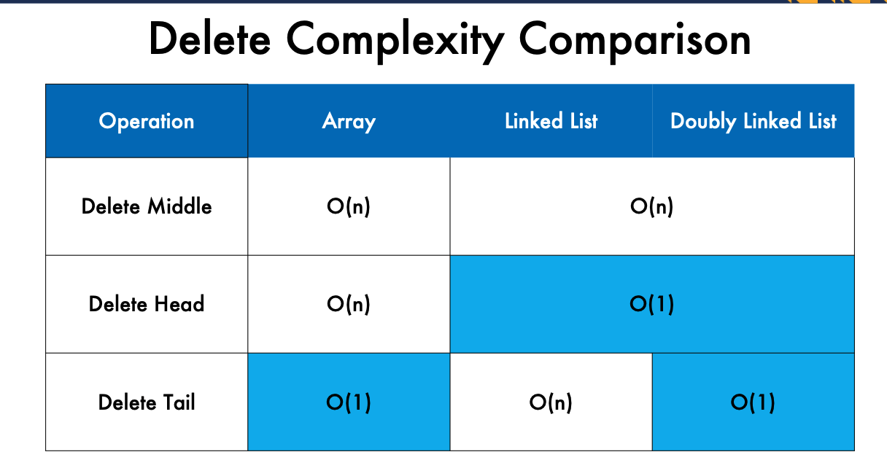
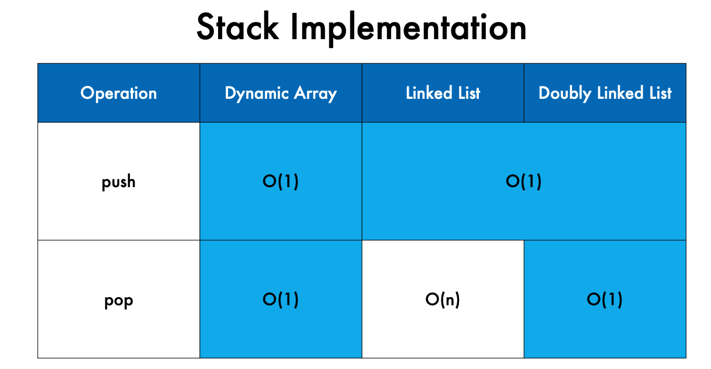
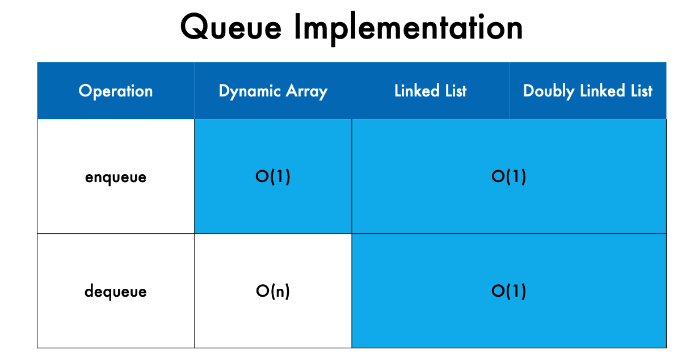
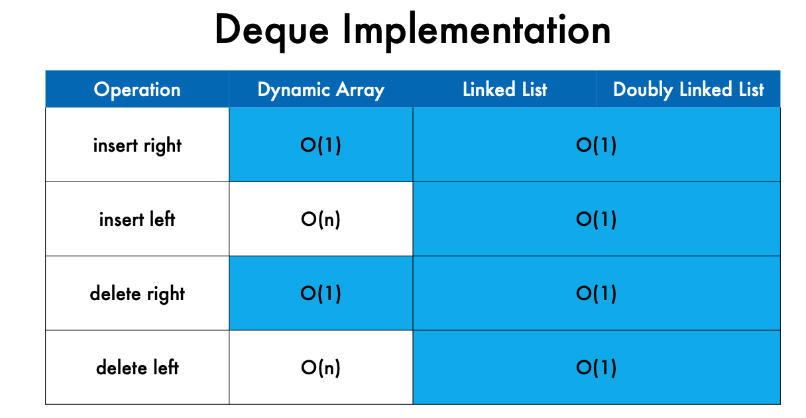

What are Linked Lists?  
• A fundamental data structure consisting of nodes  
• Space efficient, especially when growing/shrinking    
• Allocate space only when needed   
• Have performance advantage over arrays in several operations  

Linked List Applications    
• Alternative for Arrays    
• Graphs    
• File Systems  
• Music Playlists   
• Contact Lists 
• Objects in a 3D game that need to be rendered on screen 

__Linked List Structure__
Contains:   
• head reference    
• tail reference    
• count 
 
__Node Structure__  (is an object)
Contains: 
• value 
• next reference    

