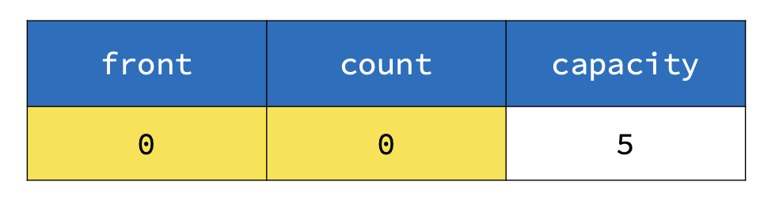
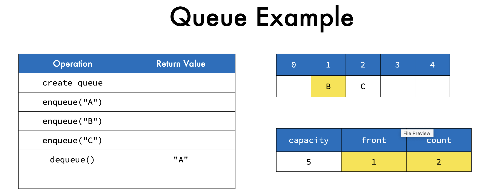
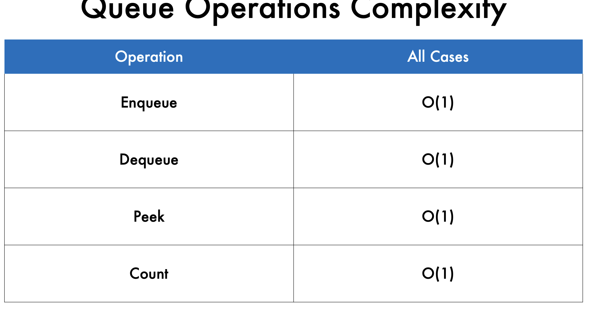

__What are Queues?__
• Efficient, commonly used data structures
• Have elements that are FIFO – First in, First Out
• Can be implemented using arrays or linked lists

__Queue Applications__
• CPU scheduling
• Disk scheduling
• Webserver load handling
• Printer queues
• Interrupts in real-time systems
• Call Center phone systems

__how to setup a queue (implementation)__

• __array__ - container for queue

• __capacity__ - maximum number of elements in the queue

• __front__ - front of the queue

• __count__ - number of elements in the queue

__Operation Description__
Enqueue add element at the back
Dequeue get and remove element __at the front__
Peek get the element at the __front__
Count get the number of elements

**Create Queue**

• Allocate an array (set capacity to some number)

• set count to 0

• set front to 0 (font pointer)

front always remains at index 0, however dequeue makes it move to next memory cell, since
value at i=0 is deleted and cell is emptied out

**Big O**

if enqueue will lead to excess the queue capacity -> we will get an error. Memory !