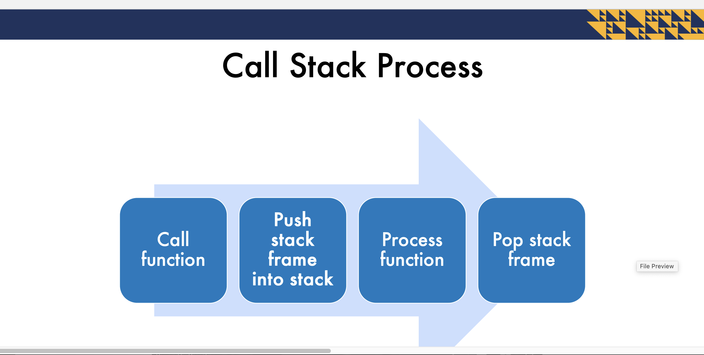
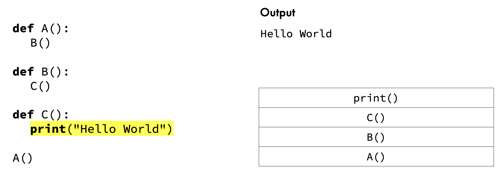
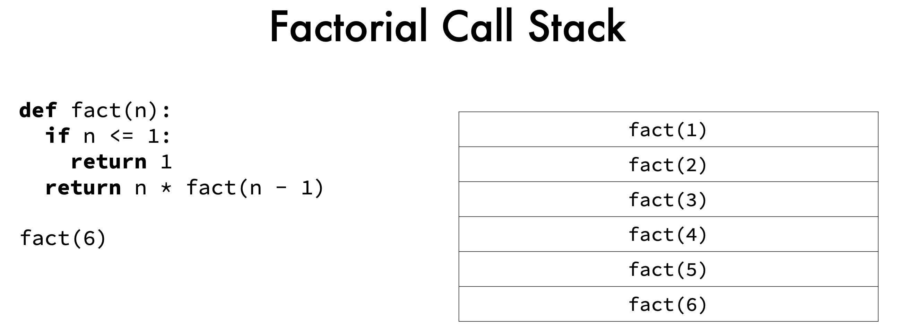

**What is Recursion?  **
• A concept where a function that calls itself to solve a smaller instance of the same problem  
• Involves breaking down complex problems into simpler subproblems  
• Unlocks advanced algorithms in simple ways

**Recursion Applications**
• Mathematics
• Combinatorics
• Hierarchal structure operations
(such as for file systems)
• Dynamic Programming

**Recursion Examples**
• Factorial
• Fibonacci
• Towers of Hanoi
• Sorting
• Maze solving

***Types of Recursion***
__Naïve Recursion - Top Down__
Uses a top-down approach - start at the original problem
and break it down to smaller subproblems
• Not the most efficient code

__Tail Recursion-Bottom Up__

***Vs. Iteration***
• Iteration
• Any iterative algorithm can be converted
to a recursive algorithm
• Usually more efficient
• Uses less space
• Requires knowledge of loop syntax

• Recursion
• More elegant
• Shorter code
• Easier to understand

__What is a Call Stack?__
• Memory location where data in function calls (stack frames) are placed
• Uses a stack as a data structure
• Only the last stack frame is active at a time

Stack Frame
• Contents:
• function parameters
• local variables
• return address
• The top of the call stack is the active frame

Each function call adds to the call stack   
• Data is added to the call stack even if function does not
explicitly create new data  
• Stack overflow occurs when call stack does not have
enough space or reaches the call stack limit    
• Usually caused by a function not reaching the base case   
