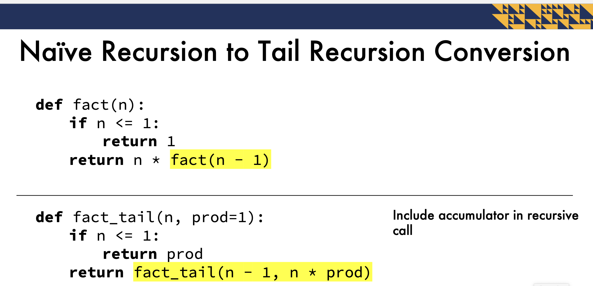

**What is Recursion? **
• A concept where a function that calls itself to solve a smaller instance of the same problem  
• Involves breaking down complex problems into simpler subproblems  
• Unlocks advanced algorithms in simple ways

**Recursion Applications**
• Mathematics
• Combinatorics
• Hierarchal structure operations
(such as for file systems)
• Dynamic Programming

**Recursion Examples**
• Factorial
• Fibonacci
• Towers of Hanoi
• Sorting
• Maze solving

**_Types of Recursion_**
**Naïve Recursion - Top Down**
Uses a top-down approach - start at the original problem
and break it down to smaller subproblems
• Not the most efficient code

**Tail Recursion-Bottom Up**

**_Vs. Iteration_**
• Iteration
• Any iterative algorithm can be converted
to a recursive algorithm
• Usually more efficient
• Uses less space
• Requires knowledge of loop syntax

• Recursion
• More elegant
• Shorter code
• Easier to understand

***Tail Recursion***    
What is Tail Recursion? 
• A special form of recursion   
• Also called bottom-up - begin with the base case and then
build up to larger problems 
• Does not perform any additional computation after
recursive call  
• Still restricted by call stack limits 

__Tail Recursion Advantage__
• Stores results as accumulator arguments
• Does not need to preserve the stack frame
• Uses O(1) vs O(n) space in the call stack
• Optimized by most compilers (tail recursion elimination)
• Results in much faster execution
• Python does not have Tail Call/Recursion Optimization

Compared to Naïve Recursion
• Can be harder to write
• Uses extra parameters for calculation (accumulators)
• No need to calculate return values
• Returns accumulator value at the end

__Naïve Recursion to Tail Recursion Conversion__
• Add accumulator parameter(s)
• Return accumulator in base case
• Include accumulator in recursive call
• perform any necessary calculations to the accumulator

