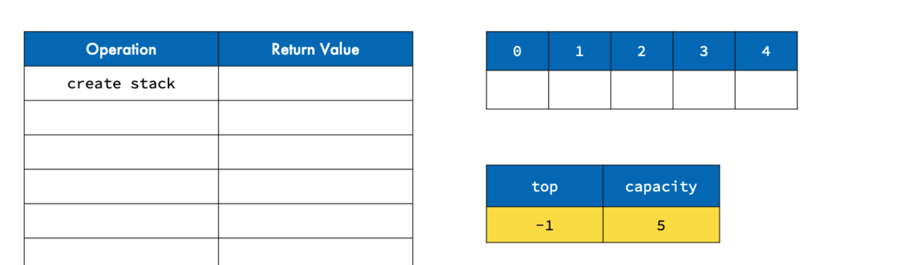
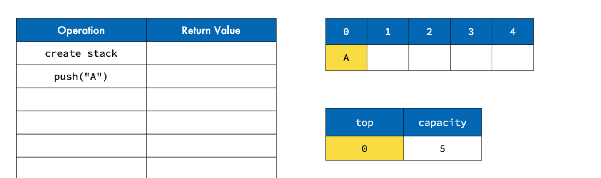

What are Stacks?
• Efficient, commonly used data structures
• Have elements that are LIFO – Last in, First Out
• __Can be implemented using arrays or linked lists__
• Limit number operations, limit number of bugs

Stack Applications:
    • Function Calls
    • Undo/Redo Feature
    • Browser Navigation
    • Storage of Temporary data

__Static Stack Representation has two features, capacity and top__
• **array**
container for stack

• **capacity**
maximum number of elements in the stack

• **top of the stack**
-1 to represent the top of an empty stack

__Stack Operations__
Operation Description
__Push__ add element at the top
__Pop__ get and remove element at the top
__Peek__ get the element at the top(-1)
__Count__ get the number of elements

Set top to -1 since the stack is empty
initiate a stack with giving a capacity and top = -1    

when top is -1 means there is stack but it is empty
when peek value (top) returns as a non -1 value -> it would be 
the value stored at top of stack 

top is changing to the latest value pushed to the stack

